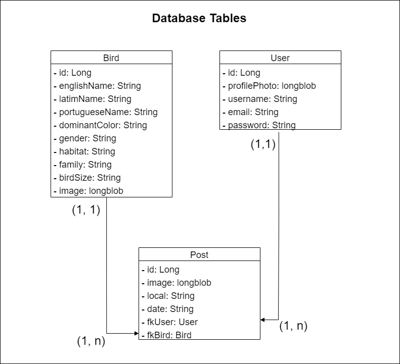

# ALPHABIRDZ

Este é o servidor desenvolvido para o app Alphabirdz, uma aplicação relacionada a observação de pássaros.

Consiste em um sistema de publicação de avistamento de aves em seus habitats naturais onde além de ser possível fazer um post com o avistamento também é possível consultar um guia com varias aves e sua descrições.
#

### Tabelas do banco 

Incialmente como ficarão as tabelas juntamente com as classes java.

#